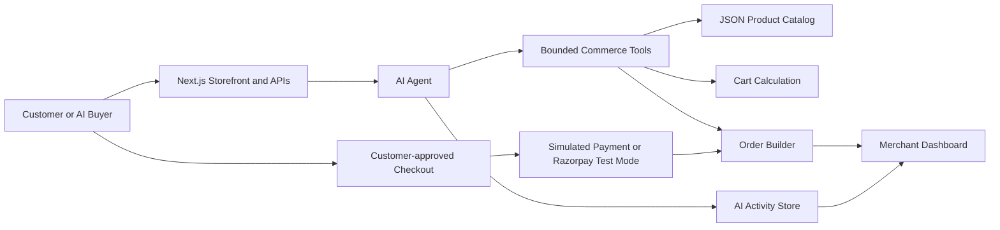

# ShopAgent AI

**Your AI-powered storefront for the next generation of buyers.**

## 1. Problem

Traditional ecommerce is designed for people to browse screens, filters, and product pages. AI buyers need structured product information and reliable actions they can perform programmatically. Merchants also need product discovery, cart, checkout, and payment flows that stay accurate when an AI is involved.

## 2. Solution

ShopAgent AI is an AI-native ecommerce platform where a shopping agent understands customer intent, searches the catalog, recommends products, suggests complementary items, manages the cart, and creates an order summary.

```text
AI Buyer -> AI Agent -> AI-readable Catalog -> Product Discovery
-> Recommendation -> Upsell -> Cart -> Checkout -> Payment -> Order -> Merchant
```

The same catalog, cart calculations, and order logic are used for both the human storefront and the external AI-buyer APIs.

## 3. Key Features

- Conversational AI shopping agent with natural-language product search
- Catalog-backed product recommendations and comparisons
- Related-product upsell and cross-sell suggestions
- Cart add, remove, quantity update, and server-calculated totals
- Customer-approved checkout and order management
- Email/password signup and login with a signed, HTTP-only session cookie
- Role-based access: every account is a user; only the configured merchant email can access Merchant pages
- Merchant dashboard with organic and AI-generated revenue
- Server-recorded AI activity and audit trail
- AI-readable product catalog and external AI-buyer APIs
- Simulated payment success, failure, and retry flow
- Razorpay Test Mode order creation, Checkout, signature verification, and webhook handling when credentials are configured
- AI-ready catalog score based on catalog completeness

## 4. Why It Is Different

This is not a storefront with a chatbot added on top. The AI performs bounded commerce actions through deterministic application tools. Product prices, stock, discounts, related products, and order totals are always supplied by the catalog and application logic, never invented by the LLM.

## 5. AI Revenue

Each cart line records how much quantity was added through AI assistance versus directly by the shopper. For example:

```text
Original cart: INR 3,999
AI upsell:     INR   499
Final cart:    INR 4,498

AI-generated revenue: INR 499
```

After payment succeeds, the confirmed order stores the organic and AI-generated split. The merchant dashboard calculates AI revenue, AI upsells, average order value, and AI conversion from those saved confirmed orders.

## 6. Razorpay / Payment

The default hackathon demo supports simulated payment success and failure so it can run without keys. The payment layer is separate from the AI and cart architecture.

When **RAZORPAY_KEY_ID** and **RAZORPAY_KEY_SECRET** are configured, the app creates a Razorpay Test Mode order, loads Razorpay Checkout in the browser, and verifies the payment signature on the server. **POST /api/payments/webhook** also verifies Razorpay webhook signatures and handles captured or failed payment updates. Payment is still initiated only after the customer explicitly clicks **Continue to Payment**.

## 7. Tech Stack

- Next.js 14 and React 18
- JavaScript
- Tailwind CSS
- Recharts for merchant revenue charts
- Optional Grok API integration with a rule-based offline fallback
- JSON catalog generated from DummyJSON
- Browser localStorage for the shopper cart and UI-side order mirror
- MongoDB for accounts, salted password hashes, and role-based sign-in
- Local JSON server store for merchant orders and AI activity
- Razorpay Checkout and Orders API when Test Mode credentials are provided

## 8. Demo Flow

1. Open ShopAgent AI and go to **AI Shopping**.
2. Ask: "I need running shoes under INR 4000 for daily running."
3. The AI searches the real local catalog and recommends an in-stock product.
4. Add the recommendation to the cart.
5. Ask for another suggestion, or use the related-product suggestion shown by the AI.
6. Accept the upsell and show the AI-generated amount in the cart summary.
7. Go to checkout and click **Continue to Payment**.
8. Use the simulated Success mode to confirm an order.
9. Retry with simulated Failure mode to show that the cart remains safe.
10. Open **Merchant Dashboard** to show AI-generated revenue and AI conversion.
11. Open **Merchant -> AI Activity** to show the action, reason, result, and revenue audit trail.

## 9. Architecture



## 10. Project Structure

```text
app/
  ai-shopping/          Conversational shopping page
  cart/ checkout/       Cart and customer-approved checkout pages
  login/ signup/        Account authentication pages
  merchant/             Dashboard, orders, AI activity, catalog, and campaigns
  api/                  Auth, chat, catalog, AI-buyer, checkout, merchant, and payment routes
agent/                  Agent graph, prompts, and bounded tools
components/             Storefront, AI chat, cart, payment, and merchant UI
lib/                    Catalog, cart, orders, payment, storage, and metrics helpers
data/                   DummyJSON-derived catalog and local commerce store
scripts/                Catalog generator
```

## 11. Setup & Run

Requirements: Node.js 18+ and npm.

```powershell
npm install
Copy-Item .env.local.example .env.local
npm run seed
npm run dev
```

Open http://localhost:3000.

**npm run seed** refreshes the local DummyJSON-derived catalog. It is optional if **data/products.json** already exists.

All environment variables are optional for the local demo:

```env
# Optional Grok integration. Without it, the rule-based fallback is used.
XAI_API_KEY=
XAI_MODEL=grok-2-latest

# Optional Razorpay Test Mode integration.
RAZORPAY_KEY_ID=
RAZORPAY_KEY_SECRET=
RAZORPAY_WEBHOOK_SECRET=

# Required for signup/login. Use an Atlas connection string or local MongoDB.
MONGODB_URI=
MONGODB_DB=shopagent_ai
AUTH_SECRET=

# This account is assigned the merchant role. Other accounts are standard users.
MERCHANT_EMAIL=
```

Do not commit **.env.local** or expose any secret in client-side code.

## 12. AI Agent

The agent follows a simple separation:

- **LLM decides:** What should I do next?
- **Tools decide:** What actually happens with catalog, stock, cart, and totals?

The implemented tool layer includes **searchProducts()**, **getProductDetails()**, **compareProducts()**, **checkStock()**, **getRelatedProducts()**, **addToCart()**, **removeFromCart()**, **getCart()**, and **createOrder()**.

The agent graph permits only the mapped tool names. It returns a natural-language reply based on the deterministic tool result.

## 13. Guardrails

- The chat agent cannot directly charge a customer.
- Passwords are salted and hashed in MongoDB; sessions are signed, HTTP-only cookies.
- Only `` (the configured merchant email) receives merchant dashboard access.
- Payment requires an explicit customer action in checkout.
- Product price, stock, and totals are recalculated from the application catalog.
- Invalid quantities and out-of-stock products are rejected before checkout.
- The external AI-buyer checkout requires an explicit payment-confirmation field.
- Razorpay payment and webhook signatures are verified server-side when Razorpay is configured.
- Duplicate webhook events are ignored.
- API keys are read only from server-side environment variables.

## 14. Future Scope

- Replace local JSON storage and in-memory AI-buyer sessions with a production database and cache
- Add authentication for shoppers, merchants, and external AI buyers
- Add inventory reservation before payment
- Add smarter personalization, merchant campaigns, and notifications
- Add more AI-commerce workflows and buyer integrations

## 15. Hackathon Pitch

ShopAgent AI transforms a conventional storefront into an AI-ready commerce platform. Instead of only chatting, the agent can discover products, recommend relevant add-ons, manage the cart, and produce explainable additional revenue. The structured catalog and bounded APIs also make merchants discoverable and transactable by AI buyers, while customer approval remains central to every payment.
